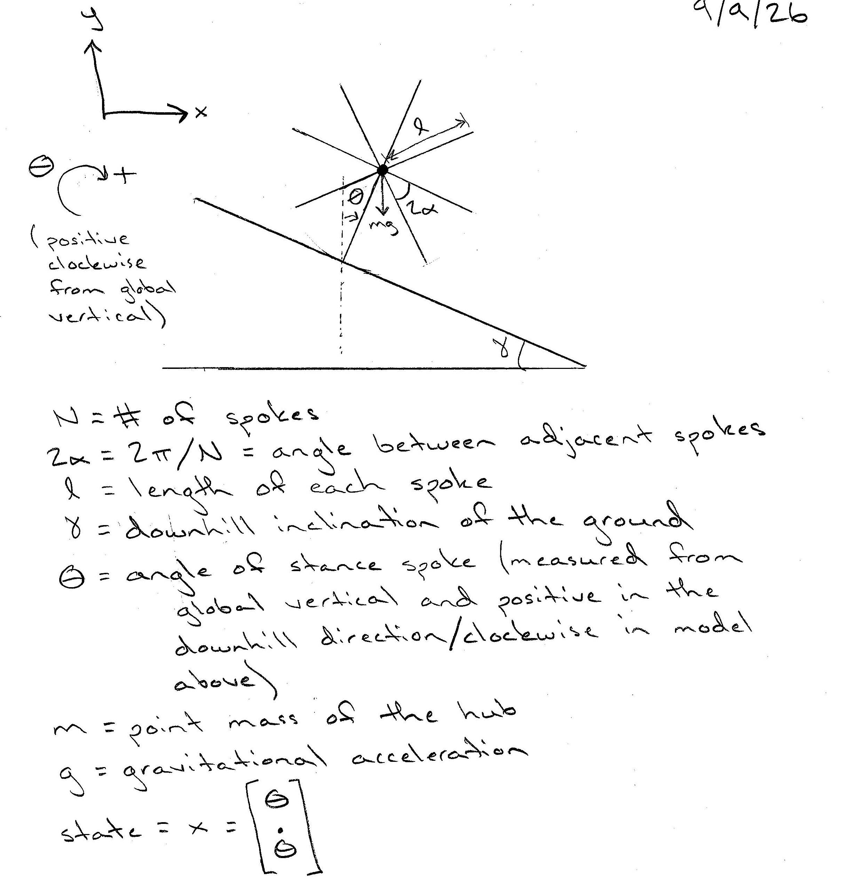

# Assignment 1

Alexis Herfurth; Net ID: ash332; 9/9/2026

## Model: the Rimless Wheel

A sketch of the rimless wheel model with parameters and states annotated is attached below.  To find the dynamics of the rimless wheel, we will first need to find its equation of motion through mechanics.  The equation of motion comes out to be $\ddot{\theta} = \frac{g}{l} \sin(\theta)$, which means the dynamics of the system are $$\dot{x} = \begin{pmatrix} \dot{\theta} \\ \ddot{\theta} \end{pmatrix} = \begin{pmatrix} \dot{\theta} \\ \frac{g}{l} \sin(\theta) \end{pmatrix}$$  Futhermore, the potential and kinetic energies of this model are $KE = \frac{1}{2} m l^2 \dot{\theta}^2$ and $PE = mgl \cos{\theta}$ (measured from the bottom of the stance spoke to the hub).  Details of the derivation, as well as two sketches, are presented below:

Dynamics of the rimless wheel:
$$\Sigma \tau = I \ddot{\theta}$$
$$\text{where } I = m l^2 \text{ is the moment of inertia of a point mass at the end of a massless rod.}$$
$$l(mg \sin(\theta)) = m l^2 \ddot{\theta}$$
$$\ddot{\theta} = \frac{g}{l} \sin(\theta)$$

Kinetic and potential energies of the rimless wheel:
$$KE = \frac{1}{2} m v^2$$
$$KE = \frac{1}{2} m l^2 \dot{\theta}^2$$
$$PE = mgl \cos{\theta}$$

As mentioned in the assignment, the rimless wheel has impact events and experiences nonsmooth jumps.  These should be modeled as an instantaneous plastic collision, where angular momentum is conserved but kinetic energy is not.  As covered in class, the new velocity should be calculated such that angular momentum about the new contact point is conserved: $\dot{\theta}^+ = \dot{\theta}^- \cos(2 \alpha)$.  During impact, $\theta = \gamma \pm \alpha$ depending on whether $\theta$ is measured from the old or new the stance spoke (also discussed in lecture).  Therefore, an impact function was implemented where impact is detected when $\theta \geq \gamma + \alpha$ and $\dot{\theta} > 0$, at which point the angular velocity is updated according to $\dot{\theta}^+ = \dot{\theta}^- \cos(2\alpha)$ and the angle is reset to $\theta = \gamma - \alpha$ to shift the coordinate system to the new stance spoke.

Two sanity checks were done to ensure the code is working properly.  The first was to check if the total energy of the system stays constant if there is no impact.  To test this, the impact function was commented out in simulate_rimless_wheel and looking at the energy plot.  If the total energy was constant, the plot would show a straight horizontal line.  Futhermore, since the rimless wheel acts like an inverted pendulum, the kinetic and potential energy plots should be periodic--similar to the energy plots in Assignment 0.  The second was to make sure the impact function was operating the way it should by verifying that the total energy plot sharply drops during impact (while staying constant elsewhere) and that state before and after correctly conserved angular momentum.  For the latter, a conditional breakpoint was added where the impact was called in the simulation.  The before and after values were verified through hand calculations.  Both checks were executed with no issues (i.e. what happened was expected).

## Analysis

A region of attraction (according to the Wikipedia page "Attractor") is a region of the phase space, over which iterations are defined, such that any point (any initial condition) in that region will asymptotically be iterated into the attractor.  In other words, a region of attraction is the set of all initial states from which a system's trajectory eventually converge to a specific attractor, such as a stable equilibrium point or a limit cycle, as time goes to infinity.

For the rimless wheel, there should be two attractors.  The first occurs when the potential energy gained (measured from the bottom of the stance spoke to the hub) at impact due to transitioning between spokes equals the kinetic energy dissipated during impact.  Once this happens, the model will enter a steady state, where the rimless wheel settles into a continuous periodic rolling or "walking."  Thus, the attractor would be a stable limit cycle.  In mathematical terms, this becomes

Kinetic and potential energies:
$$KE = \frac{1}{2} m l^2 (\dot{\theta})^2$$
$$PE = m g l \cos{\theta}$$

Energy balance once in steady state: 
$$\Delta PE + \Delta KE = 0$$

Kinetic energy before impact:  
$$KE_{before} = \frac{1}{2} m l^2 (\dot{\theta}^-)^2$$

Kinetic energy after impact:
$$KE_{after} = \frac{1}{2} m l^2 (\dot{\theta}^+)^2 = \frac{1}{2} m l^2 (\dot{\theta}^-\cos{(2\alpha)})^2$$

Loss in kinetic energy:
$$-\Delta KE = -\left(\frac{1}{2} m l^2 (\dot{\theta}^-\cos{(2\alpha)})^2 - \frac{1}{2} m l^2 (\dot{\theta}^-)^2\right) = \frac{1}{2} m l^2 (\dot{\theta}^-)^2 (1 - \cos^2{(2 \alpha)}) = \frac{1}{2} m l^2 (\dot{\theta}^-)^2 \sin^2{(2 \alpha)}$$

Potential energy before impact:
$$PE_{before} = m g l \cos(\gamma + \alpha)$$

Potential energy after impact:
$$PE_{after} = m g l \cos(\gamma - \alpha)$$

Gain in potential energy:
$$\Delta PE = m g l (\cos(\gamma - \alpha) - \cos(\gamma + \alpha))$$

Solving for the steady state angular velocity:
$$\Delta PE = -\Delta KE$$
$$m g l (\cos(\gamma - \alpha) - \cos(\gamma + \alpha)) = \frac{1}{2} m l^2 (\dot{\theta}^-)^2 (\sin^2{(2 \alpha)})$$
$$\dot{\theta}^- = \sqrt{\frac{2 g (\cos(\gamma - \alpha) - \cos(\gamma + \alpha))}{l (\sin^2{(2 \alpha)})}}$$

The second attractor takes place when the rimless wheel comes to rest because its kinetic energy can no longer overcome the potential energy, casuing angular velocity to be zero.  This attractor would be an asymptotically stable equilibrium point.  To estimate the regions of attraction faster but still accurate, we will only account initial conditions where $\theta$ is equal or greater than $\gamma + \alpha$ so that an impact is not triggered before the simulation begins.  A state-space plot showing the RoA of every stable attractor, including fixed points and limit cycles, is shown below.

Poincaré section, Floquet multiplier, and sweeps will be done on a later day.

