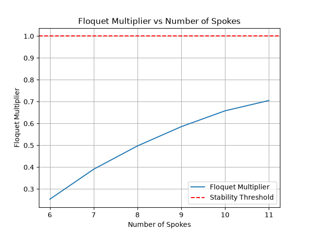

## How to Run the code

```bash
git clone https://github.com/jthomforde/MAE5110CodeAssignments.git
```

```bash
cd MAE5110CodeAssignments
```

The work for this assignment lives on a branch, so check it out before syncing:

```bash
git checkout jht224/assignment_1
```

Then run any of the seven experiments:

```bash
uv sync --python 3.14
```

```bash
uv run python assignment_1.py --experiment initial
```

```bash
uv run python assignment_1.py --experiment return_map
```

```bash
uv run python assignment_1.py --experiment roa
```

```bash
uv run python assignment_1.py --experiment roa_ramp_sweep
```

```bash
uv run python assignment_1.py --experiment roa_spoke_sweep
```

```bash
uv run python assignment_1.py --experiment floquet_ramp_sweep
```

```bash
uv run python assignment_1.py --experiment floquet_spoke_sweep
```

The return map and Floquet experiments run in a few seconds each. The three ROA sweeps take 1–2.5 minutes each.


## Model Validation

Sanity Checks:

1. Use energy plot to judge if system reaches limit cycle or resting stability
My expectation was for the system was that the kinetic and potential energy would switch at impact and the total energy would reach a steady state with my current local energy formulas not taking into account the switching reference frame. When the system comes to rest I expected to see the energy come to rest also but in most cases the tota and potential energy oscillate as kinetic energy goes to zero as potential switches in between the lower spoke contact and the higher. 
2. System at rest at [0,0], [alpha + gamma], and [-alpha + gamma] initial conditions
I expected the system to be at rest at the selected initial condition and it was confirmed true by my model. One unexpected part is the oscillitary motion and some small noise during the two spokes touching at the same time IC, this ended up being the cause of my impact function and although there were oscillations, the model worked and proved to still be true. 
3. Lastly I tested the parameters to their respective bounds and making sure my system worked correctly. 
I expected the lower bound for N to be 4 and when tested I was unable to get rolling motion with a 3 spoke wheel with no added angular velocity. I then testing slope at 0 and tested rolling both ways and the model acted correctly and didn't oscillate when at rest because both spokes were at the same height. I then tested at 90 degree slope and was able to get a limit cycle.


## ROA Findings

I expected two attractors, the limit cycle and the wheel at rest. When conducting the sweep each point on the graph represents the initial conditions at that point and the color represents which attractor the point converged to. The red points converged to the red line at 0 angular velocity and the green converged to the green line representing the rolling limit cycle.
Params for the graphs:
- length: 0.5m
- mass: 0.2kg
- ramp angle: -pi/9 - varied in ramp angle sweep
- spoke number: 6 - varied in spoke number sweep
- alpha: pi/num_spokes


Ramp Angle Graph:


Spoke Number Graph:


Increasing the ramp angle raises the fraction of state space converging to the limit cycle, and so does increasing the number of spokes. Both follow from the same mechanism where a smaller alpha means less angular velocity lost at each impact, and a steeper ramp means a smaller potential energy barrier between the impact position and the peak at theta = 0.

## Poincare Section

Return Map:


Using the contact event as a Poincaré section reduces the 2-D flow to a 1-D map:
the state is (θ, θ̇), but at every impact θ is pinned to the guard angle, so only
θ̇ varies. Composing the energy conservation with the collision gives the return map:

    P(ω) = cos(2α)·√(ω² + D),   D = (2g/L)[cos θ_start − cos θ_land] = 13.4209

Setting P(ω*) = ω* gives the fixed point ω* = √D / tan(2α) = **2.1151 rad/s**,
which is where the map crosses the identity line in the figure below.

## Floquet Multiplier Perturbation Sweep:

Deciding what perturbation to use:
I swept perturbations from .01 to 0.5 to find a value that would find an accurate slope but not be too vulnurable to noise. I chose 0.1 because it was the closest to the theoretical value of 0.25. Results are below:

Analytic value, λ = cos²(2α) = 0.250000.

| δ | λ (measured) | error vs 0.250000 |
|---|---|---|
| 0.50 | 0.248189 | 1.8e-03 |
| 0.20 | 0.251057 | 1.1e-03 |
| 0.10 | 0.249631 | 3.7e-04 |
| 0.05 | 0.247888 | 2.1e-03 |
| 0.02 | 0.236129 | 1.4e-02 |
| 0.01 | 0.254847 | 4.8e-03 |

The estimate is most accurate at δ = 0.1 and degrades on both sides. Large δ
measures a less accurate slope across the curve rather than the limit cycle's tangent. Small
δ is too vulnerable to system noise. The estimated usable
window is δ ≈ 0.05–0.5, and δ = 0.1 was used as the estimate.

## Floquet Graphs Spoke and Slope Sweeps

Params for the graphs:
- length: 0.5m
- mass: 0.2kg
- ramp angle: -pi/9 - varied in ramp angle sweep
- spoke number: 6 - varied in spoke number sweep
- alpha: pi/num_spokes


Ramp angle does not have an effect on the floquent multiplier. As the ramp angle increases from 5 to 45 degrees the floquent multiplier stays steady around 0.25. This is expected mathmatically. As long as alpha doenst change the multiplier should stay the same. 



As the numver of spokes increase, floquet multiplier increases as well. This larger eigenvalue represents a longer convergence to the limit cycle. Mathmatically as number of spokes increases, alpha decreases and the rimless wheel approaches the dynamics of a real wheel. At alpha = 0, the floquet multiplier will = 1 and the wheel will never reach the limit cycle. The sweep acted as expected for the number of spokes I iterated over. 


