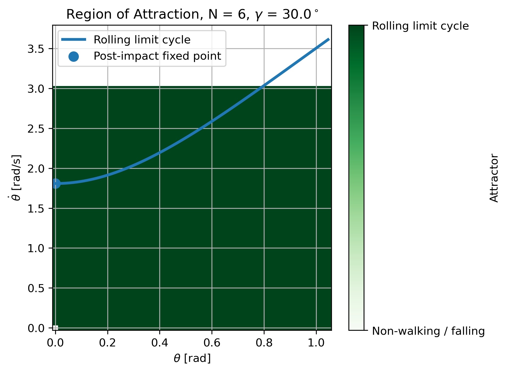
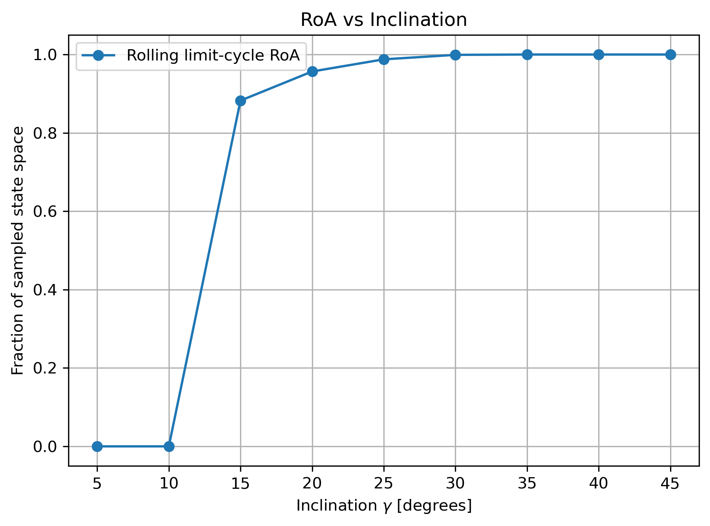
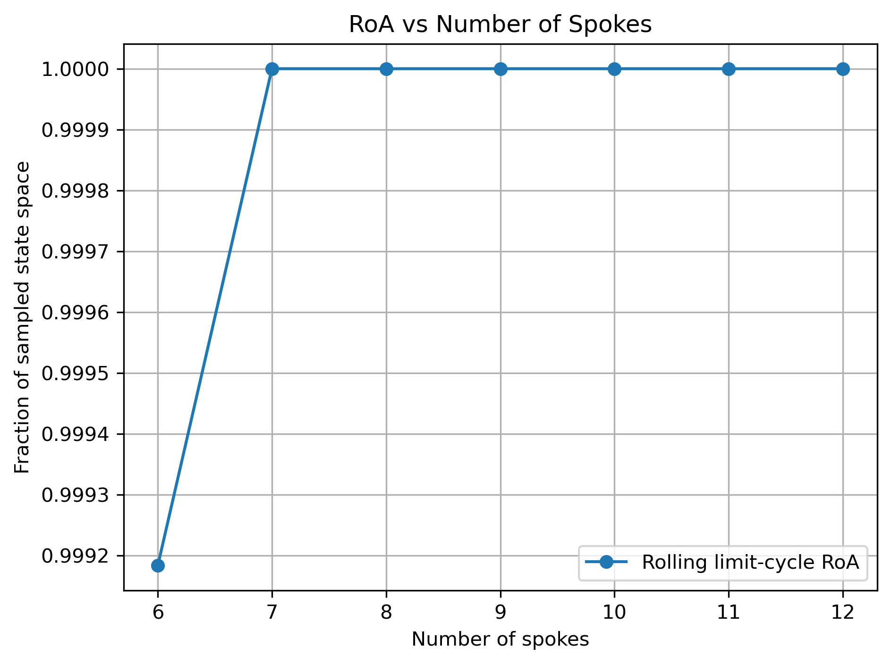
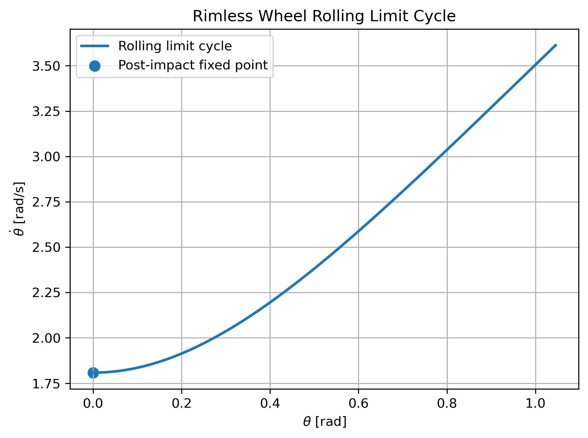
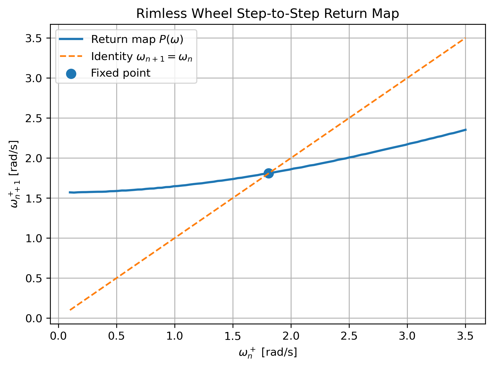
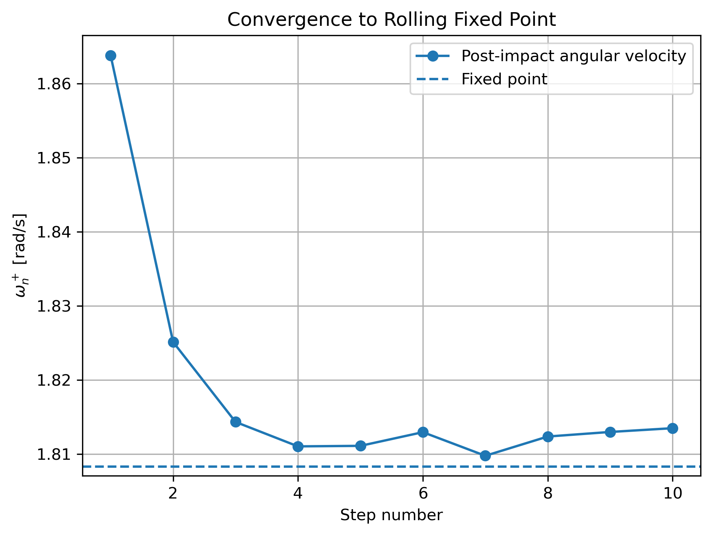
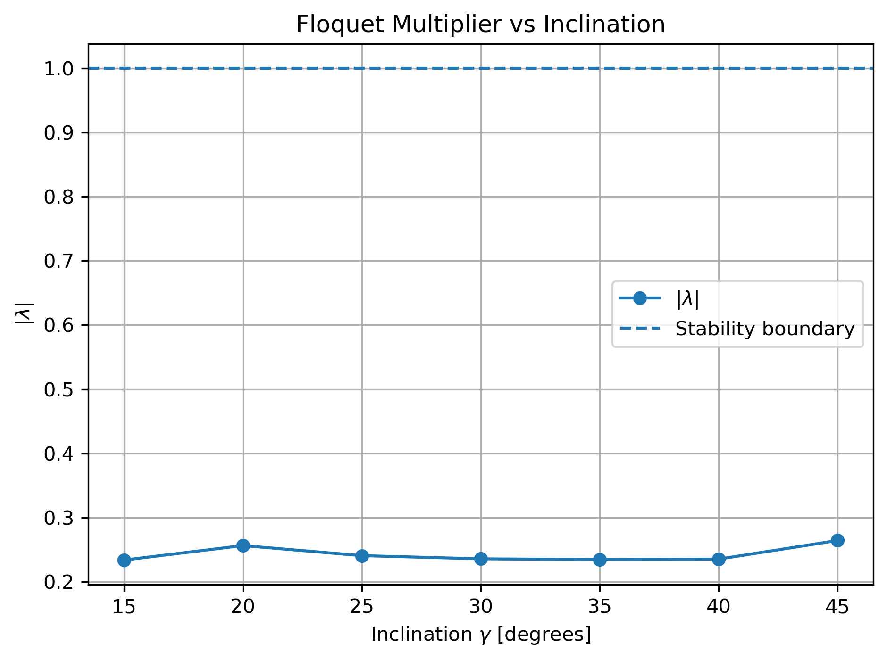
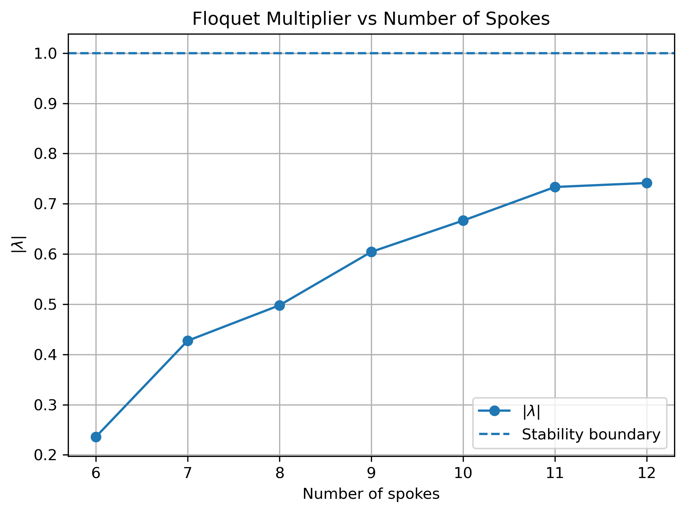

# Deliverables for Assignment 1 for MAE 4110

## Explanation of Sanity Checks — Including What I Expected and What Happened

The relevant assignment can be found in `assignment_1.py`. To run the file, follow the directions are enumerated below:

```bash
wsl

git clone https://github.com/JonathanDistler/MAE5110CodeAssignments.git

cd MAE5110CodeAssignments

uv sync --python 3.14
```

Then,

```bash
python assignment_1.py
```

The sanity checks were implemented before the actual `assignment_1.py`, and the corresponding assignment was built on top of much of its functionality. The first sanity check was to plot time versus $\theta$ and time versus $\dot{\theta}$ for a well-studied case consisting of a 6-spoke rimless wheel on a 30-degree incline. I expected the system to exhibit cyclical motion corresponding to a stable rolling gait, much like the moon-stepper. The resulting plots showed the expected cyclical behavior, which indicated that the original dynamical derivation and numerical implementation were working as intended.

Next, I tested several timestep sizes and monitored $\Delta\dot{\theta}$ to determine the point at which the numerical solution began to diverge. This investigation informed the choice of a timestep of $0.001$ \textit{seconds} for the final simulation. I also varied the perturbation size used to calculate the Floquet multiplier and identified the range over which the estimated multiplier remained consistent before numerical error began to dominate. A perturbation size of $0.05$ \textit{rad/s} was ultimately selected.

Finally, I performed sweeps over both the inclination angle $\gamma$ and the number of spokes. These sweeps were used to evaluate the computational performance of the simulation and to check whether the resulting behavior agreed with my intuition. For example, at a zero-degree incline ($\gamma=0^\circ$), I expected the system not to develop a cyclical rolling gait unless the initial angular velocity was sufficiently large. I also examined edge cases, such as $\gamma=0^\circ$ and $\gamma=90^\circ$, to verify that the resulting behavior was consistent with expectations.

Overall, these sanity checks were primarily intended to verify that the numerical implementation was functioning correctly and that the resulting behavior was consistent with the known dynamics of the rimless wheel. The results were also compared with the corresponding material from MIT's Underactuated Robotics resources and their implementation. Once the numerical behavior and edge cases agreed with these expectations, I proceeded with the remaining analyses.

## A State-Space Plot Showing the RoA of Every Stable Attractor, Including Fixed Points and Limit Cycles

The Region of Attraction (RoA) was estimated by selecting a grid of initial conditions in the $(\theta,\dot{\theta})$ state space and simulating the rimless wheel from each initial condition. Each initial condition was then classified based on whether the system converged to the rolling limit cycle or failed to maintain the rolling gait.

For the baseline case of $N=6$ spokes and $\gamma=30^\circ$, the resulting Region of Attraction is shown below. The rolling limit cycle and its corresponding post-impact fixed point are also shown on the plot. The inclination angle was then varied to examine how the Region of Attraction changed as the slope of the ramp changed. The number of spokes was also varied from 6 to 12 to examine how the geometry of the rimless wheel affected the size of the Region of Attraction.







## One-Dimensional Return-Map Plot, With Its Fixed Point and the Identity Line Clearly Marked

The one-dimensional return map was constructed using the foot-contact event as a Poincaré section. The angular velocity immediately after one impact was recorded and compared with the angular velocity immediately after the following impact. This produced a step-to-step return map of angular velocity. For the approximation of the slope in this region, it is common practice to use a Jacobian-Taylor expansion, but given the lower order of the system, it made sense to use a more direct numerical approach to find the slope.

The identity line was included on the plot to clearly identify the fixed point of the return map. The intersection between the return map and the identity line represents the steady-state angular velocity of the rolling gait. The slope of the return map at this fixed point can then be used to estimate the Floquet multiplier and determine the local stability of the rolling gait.







## Visualization and Discussion of How the Inclination and Number of Spokes Affect the RoA and Local Convergence

The effect of the inclination angle on the local convergence of the rolling gait was evaluated using the Floquet multiplier. The multiplier was estimated from the local slope of the return map near its fixed point. The number of spokes was then varied from 6 to 12 to examine how the wheel geometry affected the Floquet multiplier and local convergence. Finally, convergence toward the rolling fixed point was visualized by starting the wheel with an angular velocity slightly different from the fixed-point value and observing how the angular velocity changed over successive impacts.

The magnitude of the Floquet multiplier indicates how quickly perturbations decay from one step to the next. As noted in both class and the [Floquet Multiplier Lecture](https://www.youtube.com/watch?v=rEb8Ey07CXA), a Floquet multiplier is very much like an eigenvalue. In discrete time, as is the case with a Poincaré mapping, as long as all of the Floquet multipliers are below 1 in magnitude, the rolling gait is locally stable, with smaller magnitudes corresponding to faster convergence.

As seen in the graphs, all of the inclines produced similar (and small) Floquet multipliers for a 6-spoke roller, meaning that they all converge towards the rolling gait relatively quickly for the 6-spoke roller. Additionally, the 6-spoke roller had the smallest Floquet multiplier at the 30-degree incline, meaning it will converge quickly (under all definitions of stability: exponential, Lyapunov, and asymptotic) and to a rolling gait at a 30-degree incline.

More permutations of inclination, number of spokes, and initial conditions could be considered at a great computational cost, but they all highlight the following: a system will only walk forward if

$$
\dot{\theta} > \omega_1
=
\sqrt{
2\frac{g}{l}
\left(
1-\cos(\gamma-\alpha)
\right)
},
$$

with $\alpha$ defined as

$$
\alpha=\frac{\pi}{N}.
$$

As an aside, the return map is undefined in some specific instances because the wheel will end up at $\theta=\dot{\theta}=0$ [Underactuated Robotics](https://underactuated.csail.mit.edu/simple_legs.html?utm_source=chatgpt.com#Coleman98a)
 


