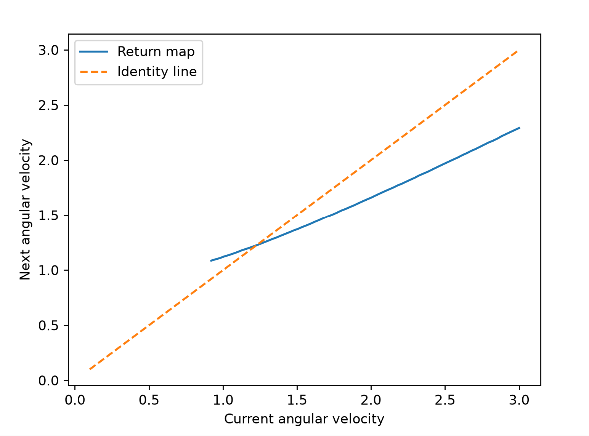

1. An explanation of your sanity checks, including what you expected and what happened; (5 pts)

    

2. A state-space plot showing the RoA of every stable attractor, including fixed points and limit cycles; (5 pts)

3. Your one-dimensional return-map plot, with its fixed point and the identity line clearly marked; and (5 pts)

4. Visualization and discussion of how the slope and number of spokes affects the RoA and local convergence (10 pts)

